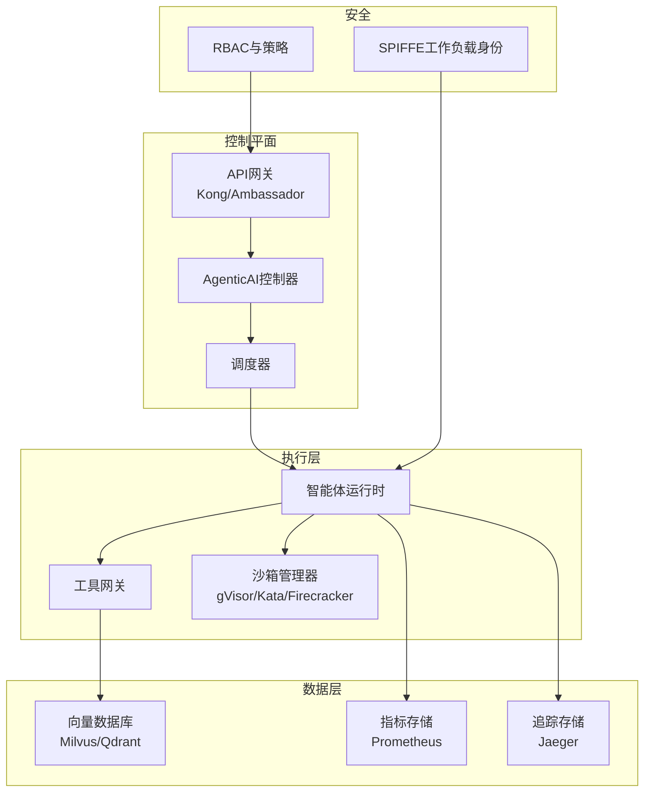

# AgenticAI Platform (中文版)


[](LICENSE)
[](go.mod)
[](https://hub.docker.com/r/turtacn/agenticai)
[](https://coveralls.io/github/turtacn/agenticai?branch=main)

**企业级云原生智能体AI基础设施平台**

AgenticAI Platform 是一个全面的、Kubernetes原生的基础设施平台，专为企业级AI智能体的部署、管理和治理而设计。平台以安全性、可观测性和成本优化为核心，为运行AI工作负载提供统一的治理能力。

[English Version](README.md) | [中文版本 README](README-zh.md)


## 为什么选择 AgenticAI Platform？

传统AI部署在企业环境中面临的关键挑战：

* **安全隔离不足**: 高风险AI操作（代码执行、网页浏览）缺乏适当的沙箱环境
* **资源管理低效**: GPU资源利用率不高，调度机制不完善
* **可观测性缺失**: 对AI智能体行为和性能缺乏充分的可见性
* **治理能力不足**: 缺乏有效的审计跟踪和合规控制
* **集成复杂度高**: 难以在不同AI模型间标准化工具交互
* **成本控制困难**: 缺乏有效的成本跟踪和优化机制

AgenticAI Platform 通过以下能力解决这些痛点：

✅ **企业级安全** - 基于gVisor、Kata Containers和Firecracker的多层沙箱隔离

✅ **Kubernetes原生** - 充分利用云原生生态系统的可扩展性和可靠性

✅ **完整可观测性** - 基于OpenTelemetry的全栈追踪、指标和日志

✅ **统一工具协议** - MCP（模型上下文协议）支持标准化工具交互

✅ **成本优化** - 实时成本跟踪和资源优化建议

✅ **全面治理** - 基于SPIFFE的身份认证、审计跟踪和合规控制

## 主要功能特性

### 🏗️ **核心架构**

* **MCP协议支持**: 为AI智能体提供标准化工具交互协议
* **OpenAPI网关**: 与现有REST API的无缝集成
* **Kubernetes原生**: 与K8s调度和资源管理的完整集成
* **多云就绪**: 可部署在任何Kubernetes集群，无论本地还是云端

### 🔒 **安全与治理**

* **工作负载身份**: 基于SPIFFE的安全服务间通信
* **沙箱运行时**: 多种隔离选项（gVisor、Kata、Firecracker）
* **API管理**: 认证、授权、限流和监控
* **审计跟踪**: 完整记录所有智能体行为和工具调用

### 📊 **可观测性与监控**

* **OpenTelemetry集成**: 分布式追踪、指标和结构化日志
* **性能指标**: GPU利用率、P95延迟、每任务成本跟踪
* **实时仪表板**: 基于Grafana的系统健康可视化
* **告警管理**: 基于Prometheus的关键阈值告警

### ⚡ **资源管理**

* **动态资源分配**: 基于工作负载的自动GPU和CPU扩缩容
* **拓扑感知调度**: 优化的资源放置以提升性能
* **RDMA支持**: 大规模数据传输的高性能网络
* **成本跟踪**: 每任务成本计算和优化建议

### 🧪 **测试与质量保障**

* **基准测试集成**: 内置WebArena和AgentBench支持
* **CI/CD集成**: 部署流水线中的自动化测试
* **自定义测试套件**: 可扩展的领域特定测试框架
* **性能基线**: 持续监控性能回归

## 快速开始

> **注意:** 本项目目前正处于密集的重构和稳定化阶段。以下说明适用于希望参与贡献的开发者。

### 环境依赖

* 一个可用的 Kubernetes 集群 (例如 Kind, Minikube, Docker Desktop)
* `kubectl` 已配置好并可以访问集群
* Go 1.22+
* Docker

### 开发者入门与设置

1.  **克隆仓库:**
    ```bash
    git clone https://github.com/turtacn/agenticai.git
    cd agenticai
    ```

2.  **构建所有二进制文件:**
    此命令会将 `actl`, `controller`, `agent-runtime`, 和 `tool-gateway` 编译到 `./bin` 目录。
    ```bash
    make build
    ```

3.  **运行测试:**
    为确保一切正常，请运行单元测试套件。
    ```bash
    make test
    ```

4.  **部署到 Kubernetes:**
    目前，部署是一个手动过程。您需要：
    *   为 `controller`, `agent-runtime`, 和 `tool-gateway` 构建并推送容器镜像。
    *   应用 `config/crd` 目录下的 CRD 清单。
    *   应用控制器的部署清单 (将在 `config/manager` 中创建)。

### 基础用法示例 (面向开发者)

与平台交互的主要方式是通过其自定义资源 (CRDs)。以下是如何使用 Go 客户端库创建一个 `Task` 资源的示例。

```go
package main

import (
    "context"
    "fmt"
    "log"

    metav1 "k8s.io/apimachinery/pkg/apis/meta/v1"
    "k8s.io/client-go/tools/clientcmd"
    
    agenticaiov1 "github.com/turtacn/agenticai/pkg/apis/agenticai.io/v1"
    "github.com/turtacn/agenticai/pkg/client/clientset/versioned"
)

func main() {
    // 使用您的本地 kubeconfig
    config, err := clientcmd.BuildConfigFromFlags("", "/path/to/your/kubeconfig")
    if err != nil {
        log.Fatal(err)
    }

    // 为我们的 CRD 创建一个 clientset
    clientset, err := versioned.NewForConfig(config)
    if err != nil {
        log.Fatal(err)
    }

    // 定义一个新的 Task
    task := &agenticaiov1.Task{
        ObjectMeta: metav1.ObjectMeta{
            Name:      "my-first-task",
            Namespace: "default",
        },
        Spec: agenticaiov1.TaskSpec{
            ImageRef: "ubuntu:latest",
            Command:  []string{"echo", "Hello from AgenticAI!"},
        },
    }

    // 在集群中创建 Task
    createdTask, err := clientset.AgenticaiV1().Tasks("default").Create(context.TODO(), task, metav1.CreateOptions{})
    if err != nil {
        log.Fatal(err)
    }

    fmt.Printf("已创建任务: %s\n", createdTask.Name)
}
```

## 架构概览

AgenticAI Platform 采用基于Kubernetes的云原生微服务架构：



详细架构信息请参见 [docs/architecture.md](docs/architecture.md)。

## 贡献指南

我们欢迎社区贡献！以下是参与方式：

### 开发环境设置

```bash
# 克隆仓库
git clone https://github.com/turtacn/agenticai.git
cd agenticai

# 安装依赖
go mod download

# 运行测试
make test

# 构建项目
make build

# 本地运行
./bin/actl --help
```

### 贡献指南

1. **Fork仓库**: 在GitHub上创建您自己的fork
2. **创建功能分支**: `git checkout -b feature/amazing-feature`
3. **进行更改**: 实现您的功能或bug修复
4. **添加测试**: 确保您的更改经过充分测试
5. **运行质量检查**: `make lint test`
6. **提交更改**: 使用约定式提交消息
7. **提交Pull Request**: 创建带有清晰描述的PR

### 代码标准

* 遵循Go最佳实践和约定
* 保持测试覆盖率在80%以上
* 为新功能添加全面文档
* 使用约定式提交消息
* 确保所有CI检查通过

### 社区

* **GitHub讨论**: 提问和分享想法
* **Slack频道**: 加入我们的[社区slack](https://agenticai.slack.com)
* **每周会议**: 参与我们的社区电话会议
* **文档**: 帮助改进我们的文档和教程

## 路线图

* **step 1**: 核心平台MVP，基础智能体执行
* **step 2**: 增强安全性，多沙箱支持
* **step 3**: 高级可观测性和成本优化
* **step 4**: 企业功能和认证合规

查看我们的[详细路线图](docs/roadmap.md)了解更多信息。

## 许可证

本项目采用Apache License 2.0许可证 - 详见[LICENSE](LICENSE)文件。

## 支持

* **文档**: [docs.agenticai.io](https://docs.agenticai.io)
* **GitHub Issues**: 报告bug和功能请求
* **社区论坛**: [community.agenticai.io](https://community.agenticai.io)
* **企业支持**: [enterprise@agenticai.io](mailto:enterprise@agenticai.io)

---

**如果您觉得这个项目有用，请给我们一个Star ⭐！**

由AgenticAI社区用❤️构建。