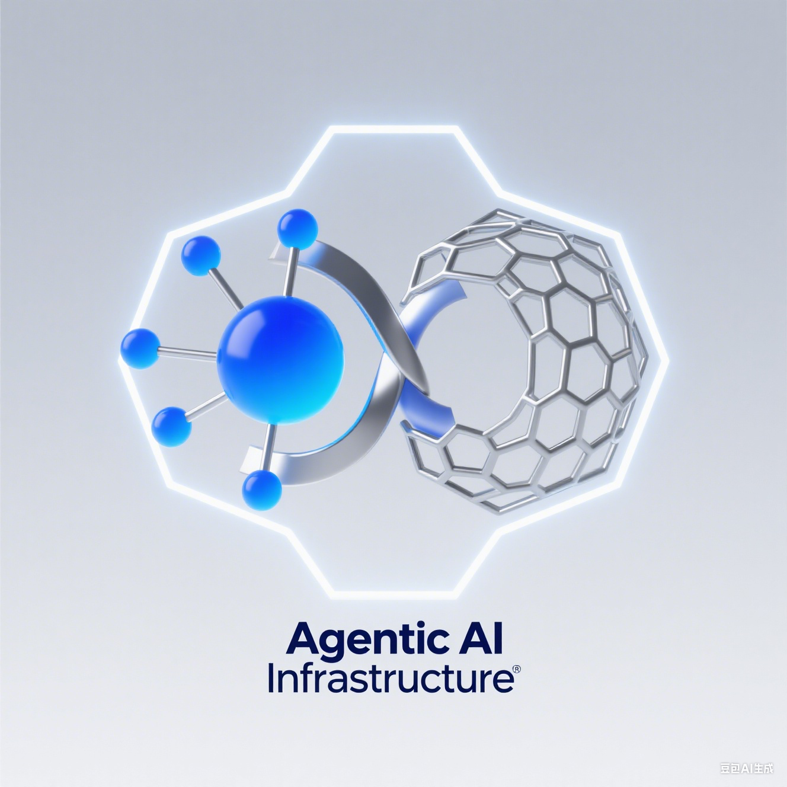

# AgenticAI Platform



[](LICENSE)
[](go.mod)
[](https://hub.docker.com/r/turtacn/agenticai)
[](https://coveralls.io/github/turtacn/agenticai?branch=main)

**An Enterprise-Grade, Cloud-Native Agentic AI Infrastructure Platform**

Agentic AI Platform is a comprehensive, Kubernetes-native infrastructure designed to deploy, manage, and govern AI agents at enterprise scale. Built with security, observability, and cost optimization in mind, it provides a unified platform for running AI workloads with complete governance capabilities.

[中文版本 README](README-zh.md) | [English Version](README.md)


## Why AgenticAI Platform?

Traditional AI deployment faces critical challenges in enterprise environments:

* **Security Isolation**: High-risk AI operations (code execution, web browsing) lack proper sandboxing
* **Resource Management**: GPU resources are underutilized and poorly scheduled
* **Observability Gaps**: Limited visibility into AI agent behavior and performance
* **Governance Deficits**: Insufficient audit trails and compliance controls
* **Integration Complexity**: Difficult to standardize tool interactions across different AI models
* **Cost Control**: No effective cost tracking and optimization mechanisms

AgenticAI Platform addresses these pain points by providing:

✅ **Enterprise-Grade Security** - Multi-layer sandboxing with gVisor, Kata Containers, and Firecracker

✅ **Kubernetes-Native** - Leverages cloud-native ecosystem for scalability and reliability

✅ **Complete Observability** - Full-stack tracing, metrics, and logging with OpenTelemetry

✅ **Unified Tool Protocol** - MCP (Model Context Protocol) support for standardized tool interactions

✅ **Cost Optimization** - Real-time cost tracking and resource optimization recommendations

✅ **Comprehensive Governance** - SPIFFE-based identity, audit trails, and compliance controls

## Key Features

### 🏗️ **Core Architecture**

* **MCP Protocol Support**: Standardized tool interaction protocol for AI agents
* **OpenAPI Gateway**: Seamless integration with existing REST APIs
* **Kubernetes Native**: Full integration with K8s scheduling and resource management
* **Multi-Cloud Ready**: Deploy on any Kubernetes cluster, on-premises or cloud

### 🔒 **Security & Governance**

* **Workload Identity**: SPIFFE-based secure service-to-service communication
* **Sandbox Runtime**: Multiple isolation options (gVisor, Kata, Firecracker)
* **API Management**: Authentication, authorization, rate limiting, and monitoring
* **Audit Trails**: Complete logging of all agent actions and tool invocations

### 📊 **Observability & Monitoring**

* **OpenTelemetry Integration**: Distributed tracing, metrics, and structured logging
* **Performance Metrics**: GPU utilization, P95 latency, cost per task tracking
* **Real-time Dashboards**: Grafana-based visualization of system health
* **Alert Management**: Prometheus-based alerting for critical thresholds

### ⚡ **Resource Management**

* **Dynamic Resource Allocation**: Automatic GPU and CPU scaling based on workload
* **Topology-Aware Scheduling**: Optimized resource placement for performance
* **RDMA Support**: High-performance networking for large-scale data transfer
* **Cost Tracking**: Per-task cost calculation and optimization recommendations

### 🧪 **Testing & Quality Assurance**

* **Benchmark Integration**: Built-in WebArena and AgentBench support
* **CI/CD Integration**: Automated testing in deployment pipelines
* **Custom Test Suites**: Extensible framework for domain-specific testing
* **Performance Baselines**: Continuous monitoring of performance regressions

## Getting Started

> **Note:** This project is currently in a heavy refactoring and stabilization phase. The instructions below are for developers looking to contribute.

### Prerequisites

* A working Kubernetes cluster (e.g., Kind, Minikube, Docker Desktop)
* `kubectl` configured to access the cluster
* Go 1.22+
* Docker

### Developer Onboarding & Setup

1.  **Clone the repository:**
    ```bash
    git clone https://github.com/turtacn/agenticai.git
    cd agenticai
    ```

2.  **Build all binaries:**
    This will compile `actl`, `controller`, `agent-runtime`, and `tool-gateway` into the `./bin` directory.
    ```bash
    make build
    ```

3.  **Run tests:**
    To ensure everything is working correctly, run the unit test suite.
    ```bash
    make test
    ```

4.  **Deploying to Kubernetes:**
    Currently, deployment is a manual process. You will need to:
    *   Build and push the container images for the `controller`, `agent-runtime`, and `tool-gateway`.
    *   Apply the CRD manifests from the `config/crd` directory.
    *   Apply the deployment manifests for the controllers (to be created in `config/manager`).

### Basic Usage Example (Developer-Focused)

The primary way to interact with the platform is through its Custom Resources (CRDs). Here is an example of how to create a `Task` resource using the Go client libraries.

```go
package main

import (
    "context"
    "fmt"
    "log"

    metav1 "k8s.io/apimachinery/pkg/apis/meta/v1"
    "k8s.io/client-go/tools/clientcmd"
    
    agenticaiov1 "github.com/turtacn/agenticai/pkg/apis/agenticai.io/v1"
    "github.com/turtacn/agenticai/pkg/client/clientset/versioned"
)

func main() {
    // Use your local kubeconfig
    config, err := clientcmd.BuildConfigFromFlags("", "/path/to/your/kubeconfig")
    if err != nil {
        log.Fatal(err)
    }

    // Create a clientset for our CRD
    clientset, err := versioned.NewForConfig(config)
    if err != nil {
        log.Fatal(err)
    }

    // Define a new Task
    task := &agenticaiov1.Task{
        ObjectMeta: metav1.ObjectMeta{
            Name:      "my-first-task",
            Namespace: "default",
        },
        Spec: agenticaiov1.TaskSpec{
            ImageRef: "ubuntu:latest",
            Command:  []string{"echo", "Hello from AgenticAI!"},
        },
    }

    // Create the Task in the cluster
    createdTask, err := clientset.AgenticaiV1().Tasks("default").Create(context.TODO(), task, metav1.CreateOptions{})
    if err != nil {
        log.Fatal(err)
    }

    fmt.Printf("Created Task: %s\n", createdTask.Name)
}
```

## Architecture Overview

AgenticAI Platform follows a cloud-native, microservices architecture built on Kubernetes:


For detailed architecture information, see [docs/architecture.md](docs/architecture.md).

## Contributing

We welcome contributions from the community! Here's how you can help:

### Development Setup

```bash
# Clone the repository
git clone https://github.com/turtacn/agenticai.git
cd agenticai

# Install dependencies
go mod download

# Run tests
make test

# Build the project
make build

# Run locally
./bin/actl --help
```

### Contribution Guidelines

1. **Fork the Repository**: Create your own fork on GitHub
2. **Create Feature Branch**: `git checkout -b feature/amazing-feature`
3. **Make Changes**: Implement your feature or bug fix
4. **Add Tests**: Ensure your changes are well-tested
5. **Run Quality Checks**: `make lint test`
6. **Commit Changes**: Use conventional commit messages
7. **Submit Pull Request**: Create a PR with a clear description

### Code Standards

* Follow Go best practices and conventions
* Maintain test coverage above 80%
* Add comprehensive documentation for new features
* Use conventional commit messages
* Ensure all CI checks pass

### Community

* **GitHub Discussions**: Ask questions and share ideas
* **Slack Channel**: Join our [community slack](https://agenticai.slack.com)
* **Weekly Meetings**: Participate in our community calls
* **Documentation**: Help improve our docs and tutorials

## Roadmap

* **step 1**: Core platform MVP with basic agent execution
* **step 2**: Enhanced security with multi-sandbox support
* **step 3**: Advanced observability and cost optimization
* **step 4**: Enterprise features and certification compliance

See our [detailed roadmap](docs/roadmap.md) for more information.

## License

This project is licensed under the Apache License 2.0 - see the [LICENSE](LICENSE) file for details.

## Support

* **Documentation**: [docs.agenticai.io](https://docs.agenticai.io)
* **GitHub Issues**: Report bugs and feature requests
* **Community Forum**: [community.agenticai.io](https://community.agenticai.io)
* **Enterprise Support**: [enterprise@agenticai.io](mailto:enterprise@agenticai.io)

---

**Star ⭐ this repository if you find it useful!**

Built with ❤️ by the AgenticAI community.