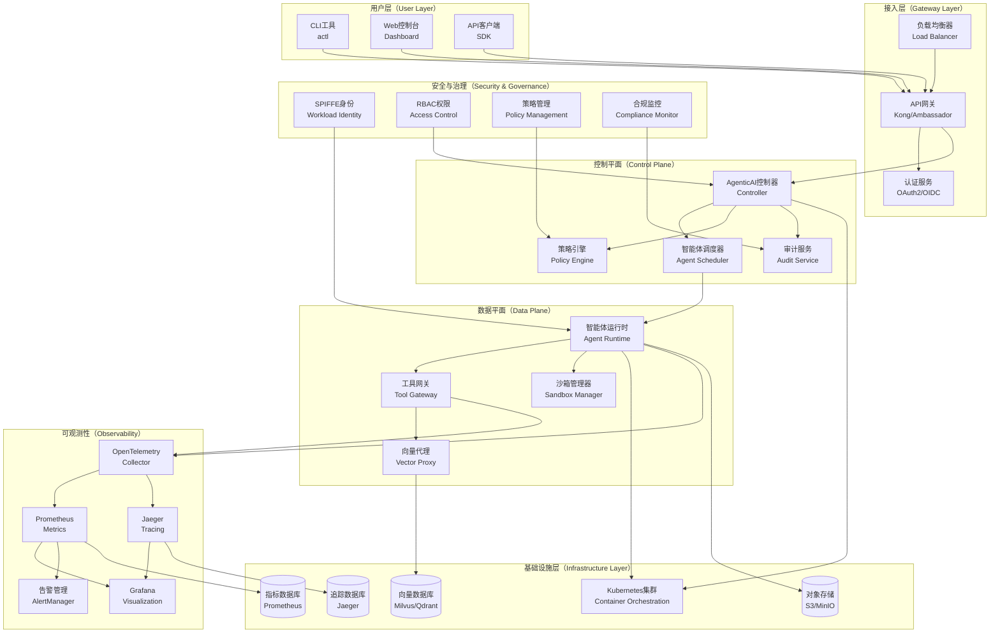
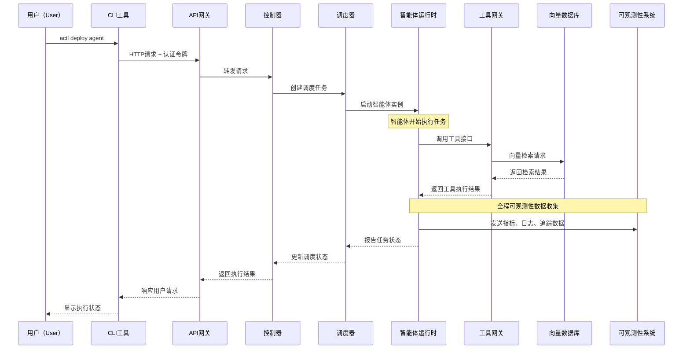
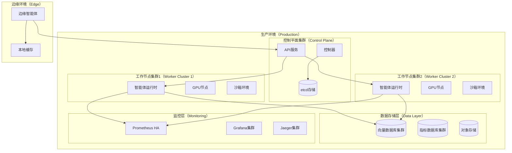

# Agentic AI Platform 架构设计文档

## 概览

AgenticAI Platform 是一个企业级的云原生智能体AI基础设施平台，专为解决大规模AI智能体部署、管理和治理中的关键挑战而设计。平台采用分层架构，基于Kubernetes生态系统构建，提供完整的安全隔离、资源管理、可观测性和成本控制能力。

### 领域问题全景

在当前AI智能体应用快速发展的背景下，企业面临以下核心挑战：

#### DFX问题分析

**1. 安全性（Security）问题**

* AI智能体执行高风险操作（代码执行、文件操作、网络访问）缺乏有效隔离
* 跨服务通信缺乏统一的身份认证和授权机制
* 敏感数据处理缺乏端到端的安全保护
* 缺乏完整的审计跟踪和合规性控制

**2. 可靠性（Reliability）问题**

* AI智能体任务执行的容错能力不足
* 资源竞争导致的系统不稳定
* 缺乏有效的故障恢复和降级机制
* 分布式环境下的一致性保障困难

**3. 性能（Performance）问题**

* GPU资源利用率低下，调度效率不高
* 网络延迟影响大规模分布式推理
* 存储I/O成为向量检索的瓶颈
* 缺乏针对AI工作负载的性能优化

**4. 可扩展性（Scalability）问题**

* 难以支持动态的工作负载变化
* 跨地域部署的复杂性
* 多租户环境下的资源隔离挑战
* 成本控制与性能平衡的困难

**5. 可维护性（Maintainability）问题**

* 缺乏统一的监控和故障诊断工具
* 版本管理和升级部署的复杂性
* 配置管理的一致性难以保证
* 技术栈复杂导致的运维负担

### 解决方案全景

AgenticAI Platform 通过以下技术架构和设计原则解决上述问题：

#### 核心解决方案

**1. 多层安全防护体系**

* 基于SPIFFE的工作负载身份认证
* 多种沙箱运行时（gVisor、Kata Containers、Firecracker）提供强隔离
* 端到端的API管理和访问控制
* 完整的审计日志和合规性监控

**2. 云原生资源管理**

* Kubernetes原生的资源调度和编排
* GPU感知的动态资源分配（DRA）
* 拓扑感知调度优化性能
* RDMA高性能网络支持

**3. 全链路可观测性**

* OpenTelemetry标准化的追踪、指标和日志
* 实时性能监控和告警
* 分布式追踪支持复杂调用链分析
* 成本透明化和优化建议

**4. 标准化工具生态**

* MCP（模型上下文协议）统一工具接口
* OpenAPI Gateway简化传统API集成
* 可插拔的工具发现和管理机制
* 向量数据库集成支持RAG能力

### 预期效果全景

#### 业务价值

**1. 效率提升**

* AI智能体任务执行效率提升40%以上
* 开发到部署周期缩短60%
* 运维工作量减少50%

**2. 成本优化**

* GPU资源利用率提升至80%以上
* 总体拥有成本（TCO）降低30%
* 精确的成本追踪和预算控制

**3. 风险控制**

* 安全事件发生率降低90%
* 合规性审计通过率达到100%
* 故障恢复时间（MTTR）缩短至分钟级

**4. 创新加速**

* 支持快速原型验证和A/B测试
* 降低AI应用试错成本
* 促进跨团队协作和知识共享

#### 技术指标

**性能指标**

* P95响应延迟 < 100ms
* GPU利用率 > 80%
* 系统可用性 > 99.9%
* 任务成功率 > 95%

**安全指标**

* 审计覆盖率 = 100%
* 安全漏洞修复时间 < 24小时
* 身份认证成功率 > 99.99%

**成本指标**

* 每任务平均成本可追踪
* 资源利用率可视化
* 成本预测准确率 > 90%

## 系统架构

### 整体架构图



### 核心组件详述

#### 1. CLI引擎（Cobra框架）

**职责**：提供统一的命令行接口，支持集群管理、智能体部署、任务监控等功能。

**核心功能**：

* 命令解析和参数验证
* 配置文件管理
* 与API网关的安全通信
* 丰富的输出格式支持（JSON、YAML、表格）

**技术实现**：

* 基于Cobra框架构建
* 支持自动补全和帮助文档
* 集成身份认证和授权
* 提供插件扩展机制

#### 2. 编排器（Orchestrator）

**职责**：系统的核心调度大脑，负责解析用户输入、加载正确的插件并管理工作流程。

**核心功能**：

* 智能体生命周期管理
* 任务调度和资源分配
* 工作流编排和依赖管理
* 故障检测和自动恢复

**关键接口**：

```go
type Orchestrator interface {
    ScheduleAgent(ctx context.Context, spec *AgentSpec) (*AgentInstance, error)
    ManageWorkflow(ctx context.Context, workflow *Workflow) error
    HandleFailure(ctx context.Context, failure *FailureEvent) error
}
```

#### 3. 插件接口系统

**工具网关（Tool Gateway）**

* 工具注册、发现和调用管理
* MCP协议实现和OpenAPI适配
* 工具版本管理和兼容性检查
* 调用链路追踪和性能监控

**智能体执行引擎（Agent Execution Engine）**

* 智能体运行时环境管理
* 任务执行状态跟踪
* 资源使用监控和优化
* 多模型支持和负载均衡

**资源管理器（Resource Manager）**

* 动态资源分配（DRA）
* GPU感知调度
* 网络拓扑优化
* 成本跟踪和预算控制

#### 4. 安全与治理模块

**身份认证与授权**

* SPIFFE工作负载身份
* 基于角色的访问控制（RBAC）
* 细粒度权限管理
* 多租户隔离

**沙箱运行时管理器**

* 多沙箱运行时支持（gVisor、Kata、Firecracker）
* 安全策略执行
* 资源限制和监控
* 恶意行为检测

#### 5. 可观测性套件

**追踪系统**

* 基于OpenTelemetry的分布式追踪
* 智能体行为完整链路跟踪
* 性能瓶颈识别和优化建议
* 调用链可视化

**指标收集**

* 实时性能指标监控
* 自定义业务指标
* 告警规则和通知
* 历史趋势分析

**日志管理**

* 结构化日志收集
* 日志聚合和检索
* 审计日志管理
* 异常检测和分析

### 数据流架构



### 部署架构



## 项目目录结构设计

```
agenticai/
├── cmd/                           # 命令行工具入口
│   ├── actl/                     # AgenticAI CLI主程序
│   │   ├── main.go              # CLI主入口
│   │   └── version/             # 版本信息
│   ├── controller/              # 控制器服务
│   │   └── main.go             # 控制器主入口
│   ├── agent-runtime/           # 智能体运行时
│   │   └── main.go             # 运行时主入口
│   └── tool-gateway/            # 工具网关服务
│       └── main.go             # 网关主入口
├── pkg/                          # 核心包
│   ├── client/                  # 客户端SDK
│   ├── types/                   # 核心类型定义
│   ├── apis/                    # API定义
│   ├── controller/              # 控制器逻辑
│   ├── scheduler/               # 调度器
│   ├── agent/                   # 智能体核心
│   ├── tools/                   # 工具管理
│   ├── security/                # 安全模块
│   ├── observability/           # 可观测性
│   ├── storage/                 # 存储抽象
│   ├── sandbox/                 # 沙箱管理
│   ├── gateway/                 # API网关
│   └── utils/                   # 工具函数
├── internal/                     # 内部包
│   ├── config/                  # 配置管理
│   ├── logger/                  # 日志组件
│   ├── errors/                  # 错误定义
│   ├── constants/               # 常量定义
│   └── metrics/                 # 指标定义
├── api/                          # API定义文件
│   ├── openapi/                 # OpenAPI规范
│   ├── proto/                   # Protocol Buffers
│   └── graphql/                 # GraphQL模式
├── deployments/                  # 部署配置
│   ├── kubernetes/              # K8s部署文件
│   ├── helm/                    # Helm Charts
│   ├── docker/                  # Docker配置
│   └── terraform/               # 基础设施代码
├── docs/                         # 文档目录
│   ├── architecture.md          # 架构文档
│   ├── apis.md                  # API文档
│   ├── development.md           # 开发指南
│   ├── deployment.md            # 部署指南
│   └── user-guide.md           # 用户指南
├── examples/                     # 示例代码
│   ├── quickstart/              # 快速开始
│   ├── advanced/                # 高级用法
│   └── benchmarks/              # 基准测试
├── test/                         # 测试目录
│   ├── unit/                    # 单元测试
│   ├── integration/             # 集成测试
│   ├── e2e/                     # 端到端测试
│   └── performance/             # 性能测试
├── scripts/                      # 脚本目录
│   ├── build/                   # 构建脚本
│   ├── deploy/                  # 部署脚本
│   └── development/             # 开发脚本
├── configs/                      # 配置文件
│   ├── default/                 # 默认配置
│   ├── production/              # 生产环境配置
│   └── development/             # 开发环境配置
├── tools/                        # 开发工具
│   ├── codegen/                 # 代码生成工具
│   ├── linting/                 # 代码检查工具
│   └── testing/                 # 测试工具
├── vendor/                       # 依赖包（可选）
├── .github/                      # GitHub配置
│   ├── workflows/               # CI/CD工作流
│   ├── ISSUE\_TEMPLATE/          # Issue模板
│   └── PULL\_REQUEST\_TEMPLATE.md # PR模板
├── Makefile                      # 构建文件
├── Dockerfile                    # Docker镜像构建
├── docker-compose.yml           # 本地开发环境
├── go.mod                        # Go模块定义
├── go.sum                        # Go模块校验
├── README.md                     # 项目说明
├── README-zh.md                  # 中文说明
├── LICENSE                       # 许可证
├── CHANGELOG.md                  # 变更日志
├── CONTRIBUTING.md               # 贡献指南
└── SECURITY.md                   # 安全政策

```

## 核心接口设计

### 智能体管理接口

```go
// AgentManager 智能体管理接口
type AgentManager interface {
    // 创建智能体
    CreateAgent(ctx context.Context, spec *AgentSpec) (*Agent, error)
    
    // 获取智能体
    GetAgent(ctx context.Context, id string) (*Agent, error)
    
    // 更新智能体
    UpdateAgent(ctx context.Context, agent *Agent) error
    
    // 删除智能体
    DeleteAgent(ctx context.Context, id string) error
    
    // 列出智能体
    ListAgents(ctx context.Context, opts ListOptions) ([]*Agent, error)
}

// TaskManager 任务管理接口
type TaskManager interface {
    // 提交任务
    SubmitTask(ctx context.Context, task *Task) (*TaskResult, error)
    
    // 获取任务状态
    GetTaskStatus(ctx context.Context, taskID string) (*TaskStatus, error)
    
    // 取消任务
    CancelTask(ctx context.Context, taskID string) error
    
    // 监控任务
    WatchTask(ctx context.Context, taskID string) (<-chan *TaskEvent, error)
}
````

### 工具管理接口

```go
// ToolRegistry 工具注册接口
type ToolRegistry interface {
    // 注册工具
    RegisterTool(ctx context.Context, tool *ToolSpec) error
    
    // 发现工具
    DiscoverTools(ctx context.Context, criteria *ToolCriteria) ([]*Tool, error)
    
    // 调用工具
    InvokeTool(ctx context.Context, call *ToolCall) (*ToolResult, error)
    
    // 获取工具元数据
    GetToolMetadata(ctx context.Context, toolID string) (*ToolMetadata, error)
}

// MCPProtocol MCP协议接口
type MCPProtocol interface {
    // 连接到MCP服务器
    Connect(ctx context.Context, server *MCPServer) error
    
    // 列出工具
    ListTools(ctx context.Context) ([]*MCPTool, error)
    
    // 调用工具
    CallTool(ctx context.Context, name string, arguments map[string]interface{}) (*MCPResult, error)
    
    // 断开连接
    Disconnect(ctx context.Context) error
}
```

### 安全管理接口

```go
// SecurityManager 安全管理接口
type SecurityManager interface {
    // 验证身份
    AuthenticateWorkload(ctx context.Context, identity *WorkloadIdentity) (*AuthResult, error)
    
    // 检查权限
    AuthorizeAction(ctx context.Context, subject, action, resource string) error
    
    // 审计日志
    AuditLog(ctx context.Context, event *AuditEvent) error
    
    // 应用安全策略
    ApplySecurityPolicy(ctx context.Context, policy *SecurityPolicy) error
}

// SandboxManager 沙箱管理接口
type SandboxManager interface {
    // 创建沙箱
    CreateSandbox(ctx context.Context, spec *SandboxSpec) (*Sandbox, error)
    
    // 执行命令
    ExecuteInSandbox(ctx context.Context, sandboxID string, cmd *Command) (*CommandResult, error)
    
    // 销毁沙箱
    DestroySandbox(ctx context.Context, sandboxID string) error
    
    // 监控沙箱
    MonitorSandbox(ctx context.Context, sandboxID string) (<-chan *SandboxMetrics, error)
}
```

## 技术选型与实现策略

### 主要编程语言选择：Go + Python

**Go语言负责的模块**：

* 控制平面组件（Controller、Scheduler、API Gateway）
* 基础设施组件（CLI、监控、日志）
* 性能关键路径（网络代理、资源管理）
* Kubernetes扩展（CRD Controller、Operator）

**Python语言负责的模块**：

* AI模型集成和推理服务
* 复杂的数据处理管道
* 机器学习工作流
* 特定AI工具的实现

**语言选择理由**：

1. **Go的优势**：

   * 云原生生态系统的首选语言
   * 优秀的并发性能和内存管理
   * 强大的标准库和丰富的Kubernetes工具链
   * 编译型语言，部署简单，性能可预测

2. **Python的优势**：

   * AI/ML领域的事实标准
   * 丰富的AI框架和库生态
   * 快速原型开发和算法实现
   * 与现有AI工具链的无缝集成

### 集成策略

**跨语言通信**：

* gRPC作为主要的服务间通信协议
* 消息队列（NATS/Redis）处理异步任务
* REST API提供标准化的接口
* 共享数据存储（Redis/PostgreSQL）

**部署策略**：

* 容器化部署，统一运行时环境
* Kubernetes Operator管理复杂的部署逻辑
* Helm Charts提供可配置的部署模板
* GitOps工作流实现声明式部署

## 参考文件

1. The reference architecture on agentic AI infrastructure and platform, [RA on Agentic AI](https://github.com/turtacn/PersonalAI/blob/master/examples/trends/04_agentic-ai-reference-architecture%26platform.md)

2. The survey on Kubernetes AI conformance, [Survey on KAC](https://github.com/turtacn/PersonalAI/blob/master/examples/trends/02_kubernetes-ai-conformance.md)

3. WIP of Kuberentes AI conformance, [WIP glance](https://github.com/turtacn/PersonalAI/blob/master/community/CNCF/Kubernetes/01_CNCF-Kubernetes-AI-Conformance.md)

3. Proposal on Kubernetes AI conformance by Agentic AI perspective,  [Proposal on KAC @ Agentic AI](https://github.com/turtacn/PersonalAI/blob/master/community/CNCF/Kubernetes/02_Proposal-of-CNCF-SIG-on-Kubernetes-AI-Conformance-AAI-perspecitve-CN.md)